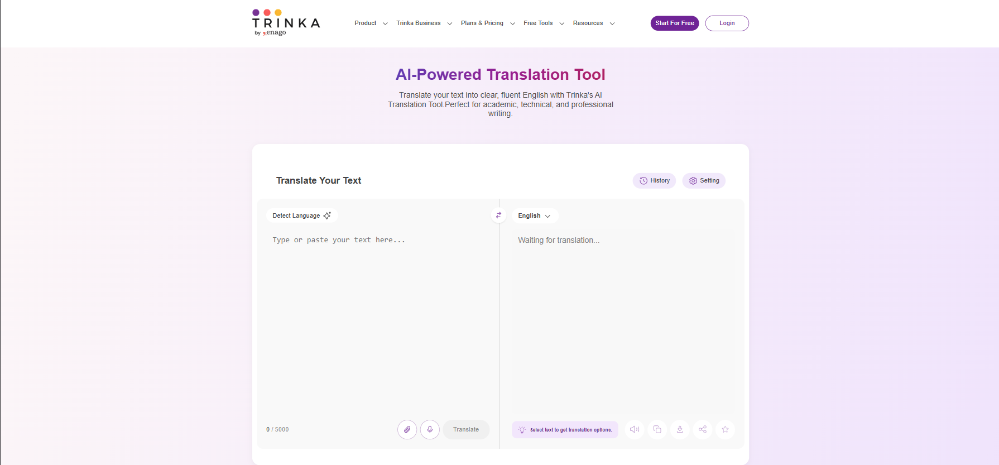
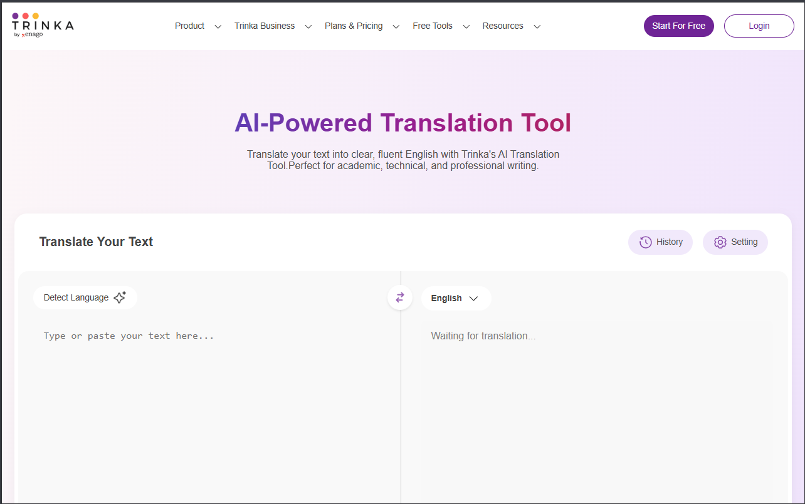
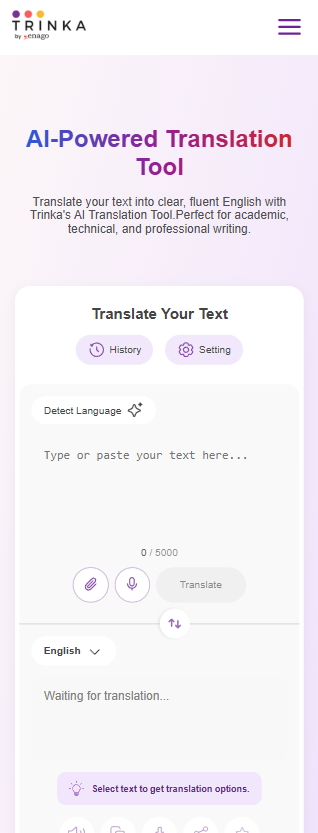

# 🚀 Responsive Landing Page

A fully responsive landing page built as part of an assignment. The page adapts seamlessly across desktop, tablet, and mobile devices using HTML, SCSS, and modern CSS features.

---

## 📸 Preview

| Desktop View | Tablet View | Mobile View |
|--------------|-------------|-------------|
|  |  |  |

---


---

## ⚙️ Technologies Used

- HTML5
- SCSS (compiled to CSS using [Live Sass Compiler](https://marketplace.visualstudio.com/items?itemName=ritwickdey.live-sass))
- Responsive design with Flexbox
- Media queries

---

## 📦 How to Run

1. Clone the repository:
   ```bash
   git clone https://github.com/yourusername/your-repo-name.git

2. Open `index.html` in your browser directly, or use a local development server (e.g., Live Server in VS Code).
